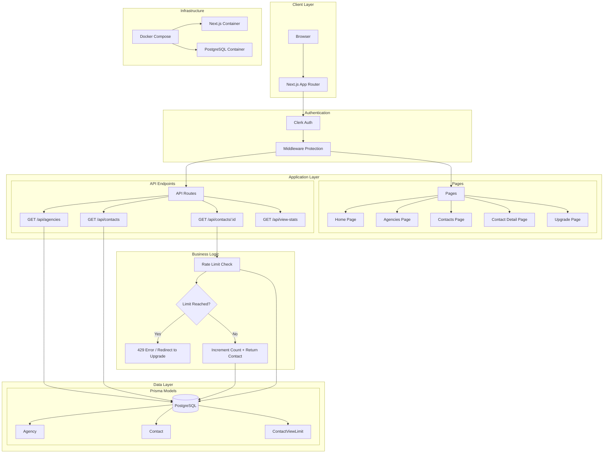
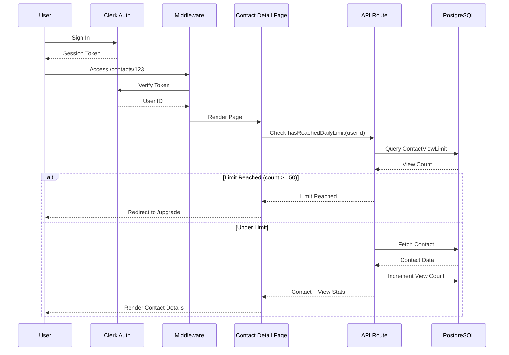
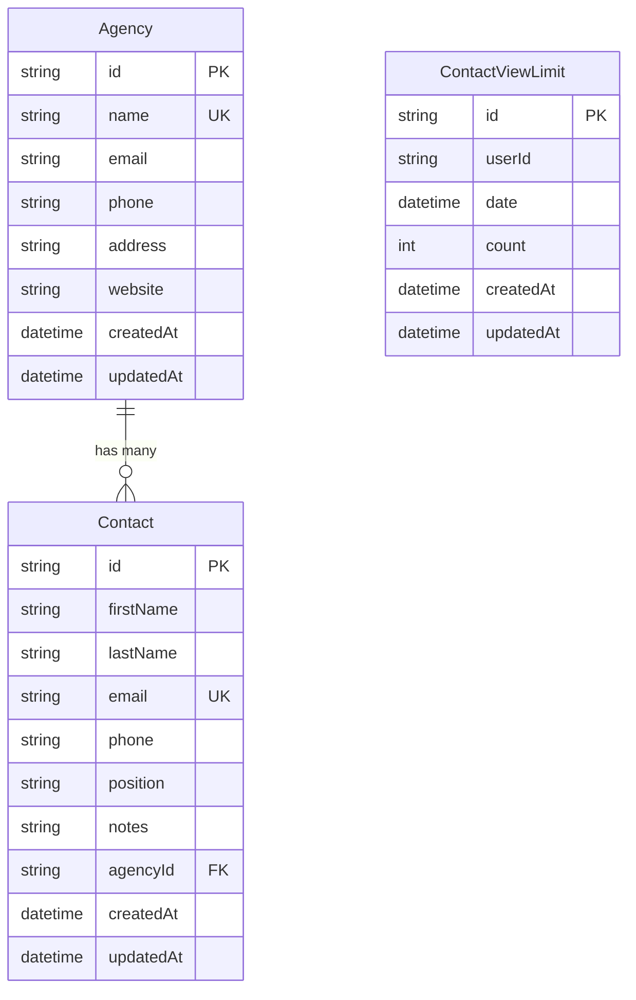

# Dashboard Application Specification

This document contains the complete specification and engineering prompt used to build this dashboard application.

---

## Engineering Prompt

You are a senior full-stack engineer.
Your task is to build an end-to-end dashboard application using:

- Next.js 16 (App Router, TypeScript)
- Clerk Authentication
- PostgreSQL + Prisma
- Docker & docker-compose
- TailwindCSS or ShadCN UI
- Vercel Deployment

You must generate production-grade code, folder structure, documentation, and architecture.
Follow best engineering patterns and write code that is complete, clean, and ready to run.

---

## 🎯 PROJECT REQUIREMENTS

### 1. Authentication (Clerk)

- Users must sign in before accessing the dashboard
- Protect all dashboard routes
- Provide Clerk frontend integration + server-side verification

### 2. Agencies Page

- Server-side rendered or client-side table
- Fetch all agencies from PostgreSQL
- Pagination + search
- Columns: agency name, city, address

### 3. Contacts Page

- Paginated and searchable table
- Each contact belongs to an agency
- "View Contact" button → open /contacts/[id]
- Display metadata: name, email, phone, agency

### 4. Daily Contact View Limit — 50/day

Implement rate-limit logic:

- Create table `ContactViewLimit` (userId, date, count)
- When user opens a contact detail page:
  - Increment count
  - If count >= 50 → block access
- Show "Upgrade Plan" modal/page when blocked
- Limit logic must be in API route and referenced by contacts detail fetch.

### 5. Database Schema (Prisma)

Generate models:

- Agency
- Contact
- ContactViewLimit

With relations, indexes, and constraints.

### 6. Data Import Script

Create `scripts/import-data.ts` that will:

- Read CSV/JSON input for agencies
- Read CSV/JSON for contacts
- Normalize mismatched agency names
- Insert data into PostgreSQL via Prisma
- Log duplicates or unmatched rows

### 7. API Endpoints (Next.js Route Handlers)

Create:

- `GET /api/agencies`
- `GET /api/contacts`
- `GET /api/contacts/[id]` (with limit logic)
- `POST /api/track-view` (optional helper)

Responses must be typed and follow clean patterns.

### 8. Docker Requirements

Generate:

- Dockerfile for Next.js (production optimized)
- docker-compose.yml including:
  - next-app service
  - postgres service
  - hot-reload volumes for development
- Add `.env.example`

### 9. Folder Structure

Output:

```
project/
  docker-compose.yml
  Dockerfile
  prisma/
    schema.prisma
  scripts/
    import-data.ts
  src/
    app/
      agencies/
      contacts/
      upgrade/
      api/
    components/
    lib/
  README.md
```

### 10. Documentation

Produce:

- Setup instructions
- How to run Docker environment
- How to migrate Prisma
- How to import data
- How to deploy to Vercel
- Mermaid system diagram

---

## 📣 CODING STYLE

You must follow:

- Clean architecture
- Modular, reusable React components
- Fully typed Prisma client
- Centralized DB utilities
- Error handling and validation
- Comments explaining logic
- Use async/await everywhere

---

## 🧠 INSTRUCTIONS

When asked to "generate", "scaffold", or "write", produce:

- Full file contents
- Required imports
- Routes, components, schemas
- Scripts and configs
- Explanations only when asked

Avoid placeholders unless necessary.

---

## System Architecture



## Data Flow Diagram



## Entity Relationship Diagram



---

## Implementation Status

| Requirement | Status | Location |
|------------|--------|----------|
| Clerk Authentication | ✅ Complete | `src/middleware.ts`, `src/app/layout.tsx` |
| Agencies Page | ✅ Complete | `src/app/agencies/page.tsx` |
| Contacts Page | ✅ Complete | `src/app/contacts/page.tsx` |
| Contact Detail Page | ✅ Complete | `src/app/contacts/[id]/page.tsx` |
| Daily View Limit (50/day) | ✅ Complete | `src/lib/contact-view-limit.ts` |
| Upgrade Page | ✅ Complete | `src/app/upgrade/page.tsx` |
| API: GET /api/agencies | ✅ Complete | `src/app/api/agencies/route.ts` |
| API: GET /api/contacts | ✅ Complete | `src/app/api/contacts/route.ts` |
| API: GET /api/contacts/[id] | ✅ Complete | `src/app/api/contacts/[id]/route.ts` |
| API: GET /api/view-stats | ✅ Complete | `src/app/api/view-stats/route.ts` |
| Prisma Schema | ✅ Complete | `prisma/schema.prisma` |
| Data Import Script | ✅ Complete | `scripts/import-data.ts` |
| Dockerfile | ✅ Complete | `Dockerfile` |
| docker-compose.yml | ✅ Complete | `docker-compose.yml` |
| Environment Config | ✅ Complete | `.env.example` |
| Documentation | ✅ Complete | `README.md` |
